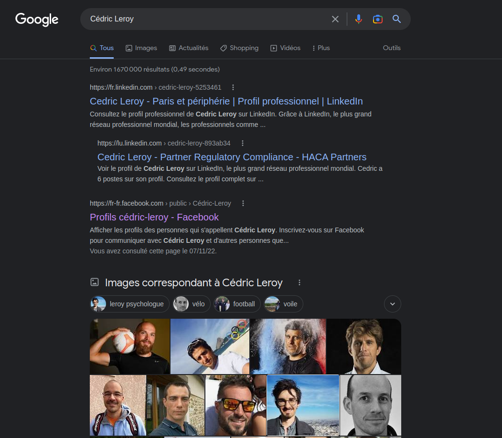

- [Projet professionnel et stratégie d'insertion](#projet-professionnel-et-stratégie-dinsertion)
  - [Projet professionnel](#projet-professionnel)
    - [Le métier](#le-métier)
    - [L'entreprise](#lentreprise)
    - [Quelles évolutions ?](#quelles-évolutions-)
  - [Stratégie d'insertion professionnelle](#stratégie-dinsertion-professionnelle)
    - [E-reputation et présence en ligne](#e-reputation-et-présence-en-ligne)
    - [Préparation aux entretiens](#préparation-aux-entretiens)
      - [Les tape-loops](#les-tape-loops)
      - [L'entraînement technique](#lentraînement-technique)
    - [Candidature et canaux de recrutement](#candidature-et-canaux-de-recrutement)

# Projet professionnel et stratégie d'insertion

## Projet professionnel
### Le métier

J'apprécie beaucoup l'algorithmie et mes premières impressions concernant le back-end m'orientent dans cette direction. 
Toutefois, possèdant une bonne capacité créative et appréciant l'UX/UI, le métier de Developpeur front-end pourrait également m'intéresser. 

Comme toute personne débutant dans le développement web, mon souhait serait de devenir un développeur "fullstack" malgré l'impossibilité de connaître toutes les facettes du back et du front. 

### L'entreprise

L'important me concernant est de trouver un environnement stimulant aux perspectives d'évolution variées. J'apprécie également beaucoup la confiance des supérieurs et l'autonomie. 

Dans ce contexte, plusieurs types d'entreprise peuvent me correspondre. 
Toutefois, dans la continuité de mon projet professionnel, l'environnement de la start-up semble plus me correspondre par la polyvalence qu'elle peut demander à ses employés. 

Appréciant la relation client, les agences Web et la réflexion sur les stratégies marketing, les agences de communication ou agences web m'intéressent également. 

### Quelles évolutions ? 

Il est difficile en tant que débutant de se projeter. Toutefois plusieurs carrières semblent me correspondre. 

Le métier d'architecte développeur m'intèresse particulièrement par la maîtrise métier qu'il recquiert. 

D'un naturel humain et confiant, les métiers du leadership sont également accessibles. Le rôle de lead dev pourrait être un exemple concret d'objectif à moyen terme. 

A court terme je souhaite rejoindre une start up et quitter progressivement le statut de junior en accompagnant la montée d'un projet. Le moyen et long terme se partagent un but de responsabilisation dans les processus d'équipes, en continuité avec ma formation précédente et mon passé professionel. 

## Stratégie d'insertion professionnelle 

### E-reputation et présence en ligne 

- **Google** : Il ne ressort rien de particulier lorsque l'on tape mon nom et prénom sur les moteurs de recherche. D'autres personnes portent ce nom et prénom, mais peu d'informations sont disponibles. 

Ce constat démontre la cible que sont les moteurs de recherche en terme de référencement d'un futur portfolio. 

- **Les réseaux sociaux personnels**: Mes réseaux sociaux sont vides de photographies "dégradantes" ou peu profesionnelles. De plus, le peu de publication existantes n'engagent pas d'opinion personelle. 
- **Les réseaux sociaux pro** : Deux réseaux sont utilisés, LinkedIn et Twitter. 
    Premièrement, un compte LinkedIn a été créé lors de mes études afin d'affirmer ma présence en ligne. Un réseau de psychologues et profesionnels de la santé a été constitué. La transition de ce compte vers le numérique n'est que peu entamé. Le réseau IT n'est que peu constitué. Un axe d'amélioration consiste en la définition d'une véritable stratégie LinkedIn avec un plan de post et d'élaboration du réseau. 
    Deuxièmement, un compte Twitter professionnel a été créé dans le but de partager mes découvertes et l'état d'avancée de ma reconversion profesionnelle. Un réseau de 150 développeurs et de profils en reconversion pro est constitué. Un objectif concernant ce compte serait de le développer de façon plus professionelle avec un plan de posts et des publications plus professionnelles. Dans ce cadre le partage de connaissances mélant psychologie et tech est une piste de réflexion. 
- **Github** : Le profil Github a également été travaillé en détail afin de faire transparaître mes motivations et mon implication nouvelle dans le développement. Les différents repository de celui-ci sont alimentés chaque jours. 

### Préparation aux entretiens 
#### Les tape-loops

Dans le cadre de la préparation aux entretiens, plusieurs tape-loops (réponse automatiques) aux questions les plus courantes en entretien sont prêtes et travaillées : 

1) Pourquoi devrions-nous vous engager ?
   Dans un groupe je pense être reconnu pour mon leadership, ma gentillesse et ma franchise. D'un autre côté je m'intègre facilement et ai une très bonne capacité d'adaptation et d'apprentissage. 
2) Avez-vous des questions ?
   Pas forcément de tape-loop pour cette question. Les questions dépendent du contexte. Il ne faut pas laisser cette question sans question en retour. 
3) Quelles sont vos qualités et vos défauts ?
   Mon ouverture d'esprit / Ma sensibilité et mon empathie qui peuvent parfois être gênantes. 
4) Préférez-vous travailler seul ou en équipe ?
   D'un naturel avenant je préfère travailler en équipe même si je considère efficace seul. 
5) Pourquoi nous avoir choisi ?
   La réponse à cette question doit être faite en fonction du contexte. 
6) Que pensez-vous nous apporter ?
   A court terme le premier bénéfice concerne avant tout ma personnalité. Rapidement mes compètences techniques seront également appréciées. 
7) Où vous voyez vous dans 2, 5, 10 ans ?
   Dans deux ans j'aimerai dépasser le stade de junior. Dans 5 ans occuper des rôles à responsabilité et m'ouvrir à d'autres domaines. Il est difficile de se projeter dans 10 ans mais j'aimerai être un développeur le plus complet possible. 
8) Comment expliquez-vous que vous n'ayez pas travaillé durant cette période ?
   La seule période d'inactivité concerne ma reconversion professionnelle. 
9)  Qu'est-ce que vous aimez faire en dehors du travail ?
    J'ai beaucoup de passions et je suis en général curieux. Principalement j'aime beaucoup la musique sous toute ses formes, j'ai pratiqué plusieurs instruments et fais de la M.A.O, désormais je suis plus axé sur l'écoute car j'ai peu de temps à consacrer à la pratique. J'aime également beaucoup le sport, en particulier l'escalade, la course à pieds, la natation et le VTT.
10) Quelles sont vos prétentions salariales ?
    Actuellement le marché est saturé de développeurs débutants. Sans vouloir dénigrer les autres ou me vanter je pense me démarquer de ceux-ci. Le salaire moyen d'un débutant étant de 30k par an, un salaire de 32k me paraît un minimum. 

#### L'entraînement technique

Un entraînement plus technique aux entretiens a également été mis en place. 

- **Repository Github Javascript-algorithm**: Un repository Github concernant la résolution de problème et l'algorithmie en Javascript a été initié. Chaque jour ce repository est alimenté par le travail sur un algorigramme, du pseudocode, ou la solution Javascript au problème donné. Les problèmes sont désormais tirés de la plateforme CodeWars.
- **Les plateformes en ligne** : PLusieurs plateformes en lignes proposent de pouvoir s'entraîner sur Javascript. Je suis inscrit et m'entraîne régulièrement sur Codewars et Codingame. La plateforme codingame étant plus difficile, le profil y est plus débutant, ce qui constitue une piste intéressante d'amélioration.
- **Javascript-info** : La plateforme Javascript-info propose de nombreuses ressources autour du langage Javascript. Quasi-quotidiennement, je lis cette documentation en ligne. 
- **La formation** : Coeur du développement de mes compétences, la formation CDA permet un entraînement global aux entretiens. 

### Candidature et canaux de recrutement

Tout d'abord un C.V. moderne et profesionnel a été travaillé dans le cadre de ma formation actuelle. Celui-ci est résolument tourné vers la recherche d'un stage en tant que développeur web fullstack. 

En plus de la présence sur les réseaux sociaux, un profil enregistré et à jour est disponible sur ces différentes plateformes : chooseYourBoss, Monster, Hellowork, Stakha, Indeed, weLoveDevs, lesjeudies, maddyjobs, BeyondSkills
De plus, des alertes de nouvelles offres sont également en place sur  de ces plateformes. 

Des alertes aux nouvelles offres sont également configurées sur LinkedIn. 

Afin de suivre l'avancement des candidatures pour la recherge de stage, un Notion a été mis en place afin de répertorier les offres d'emploi et leur avancement. 

[Notion](../img/suivi.png)