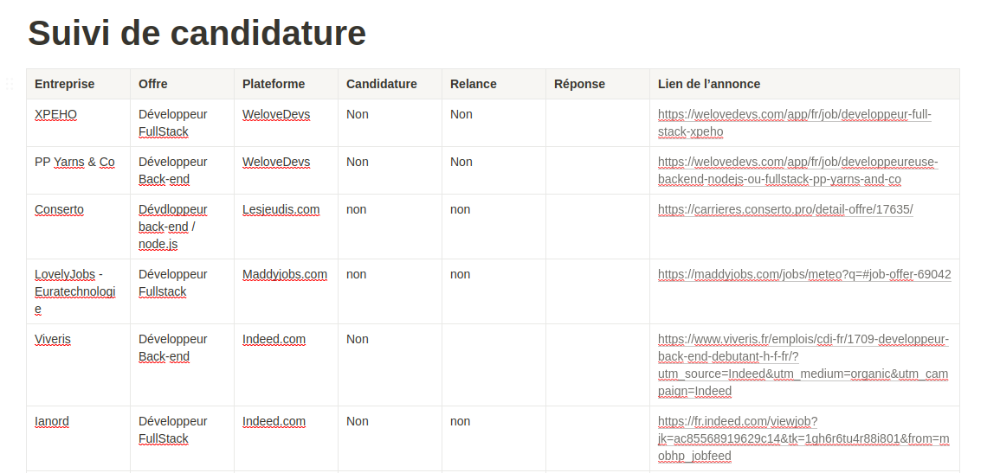

# Roadmap_dev

## Qu'est ce que le metier de FrontEnd et BackEnd?

### Les termes

- **Maitriser** :

Maîtriser peut prendre deux significations dans la langue courante : une définition se rapporte à la domination, l’autre se rapporte à la maîtrise d’une discipline. Pour une discipline, il est donc question d’une supériorité dans la connaissance de celle-ci. La maîtrise porte une idée de contrôle des événements de la discipline par la connaissance pointue de celle-ci.

- **expert** :

L’expert se rapporte à celui qui possède une expertise dans une discipline. Dans la notion d’expert ou d’expertise, il y a une notion de jugement, d’examen d’un produit. L’expertise ou l’expert est quelqu’un qui acquiert la maîtrise d’un domaine par la pratique. Son expertise lui permet de posséder de grandes connaissances sur le plan théorique comme pratique.

- **compétent** :

Une personne compétente possède une compétence à effectuer une tâche spécifique.

- **spécialisé** :

Une personne est spécialisée lorsqu’elle a été amenée ou a décidée de travailler avec un outil spécifique. Cette habitude de travail lui a permis d’acquérir des connaissances générales dans un domaine.

### Les differents roles de chaque poste

Le rôle de développeur back-end est plus ou moins large, il peut s'occuper de la partie serveur d'un projet où il va effectuer différentes missions :

- Gestion et développement d'API.
- Gestion de bases de données : traitement, stockage...
- Trouver et fixer les bugs.
- Optimisation des performances générales.
- Sécurisations.

Les rôles et missions du développeur back-end sont donc très large, cela peut découler d'une simple mission de "codeur", comme des tâches plus poussées.
Il est aussi possible que le développeur back-end s'apparente à un rôle de décisionnaire dans les choix techniques.
Si dans le cas où un architecte développeur n'est pas présent, il peut proposer et réfléchir à la mise en place de l'infrastructure ou à améliorer celle déjà en place. Il devra créer un environnement adapté aux besoins des projets.

Un développeur front-end est un programmeur informatique qui code et crée les éléments visuels d’un logiciel, d’une application ou d’un site web.
Il crée des composants / fonctionnalités informatiques directement visibles et accessibles par l’utilisateur final ou le client.
Cette profession vise le développement uniquement sur la partie client, elle sera directement téléchargeable par les utilisateurs.

Ces deux rôles ne se limitent pas seulement à la prise de decision et au développement / gestion d'applications, il est probable qu'ils devront tout deux participer à des réunions avec des clients ou avec les différents développeurs du projet.
Le principe est de faire avancer le projet en fonction des besoins du client, de la demande du projet, et de l'équipe.
Savoir jauger ses capacités et celles de son équipe est un point important pour un développeur.

### Competences et Outils

Les compétences et outils sont intimement liés, l'utilisation de certain outils demende des compétences spécifiques comme l'utilisation de _framework_ spécifiques.

Listes des compétences / outils :

- Langages liés à l'entreprise.
- Connaissances concernant les bases de données.
- Gestion de collaboration de code avec GIT
- Maitrise des regles general de la securite
- Connaissance lie au framework lie a l'entreprise
- Connaissance des software les plus communs sur linux et windows
- Bon niveau d'anglais technique
- Etre autonome

Listes des soft skills :

- Rigueur
- Sens de l'organisation
- Adaptation
- Esprit d'équipe
- Gestion du temps et du stress
- Curiosité

Ces soft skills et hard skills s'appliquent pour beaucoup de métier dans le milieu du développement, en l'occurrence, ici, pour les développeurs Back-end et Front-end.

Pour être un peu plus précis dans la liste des compétences qu'un développeur Front-end doit posséder, voici une description plus détaillée.

- Compréhension solide des langages de programmations sur lesquelles il va travailler ou avec les supports qu'il va utiliser.
- Connaissance étendue et approfondie sur la conception web.
- Certaine approche sur les logiciels d'éditions d'images.
- Communiquer et écouter le client pour concevoir un site web qui lui correspond.
- Bonne connaissance des langages de programmation côté serveur

Nous pouvons nous référer à la roadmap du développeur Front-end et Back-end pour avoir une idée plus précise des compétences qu'il doit posséder pour devenir un développeur confirmé dans son domaine :

- [RoadMap Font](https://roadmap.sh/frontend).
- [RoadMap Back](https://roadmap.sh/backend).

### Avec quelle personne est-on amené à travailler ?

Les développeurs Front et Back-end est amené plus ou moins à travailler avec la même personne, la communication avec les différentes équipes est mot d'ordre en tant que développeur.

Voici une liste non exhaustive des métiers en contacte avec des développeurs :

**Développeur Back** :

- Managers
- Lead Développeur
- Architectes
- UX et/ou UI Designer / Designer
- Chercheurs
- IT sécurity
- Développeur Front
- Développeur Back-end
- Product Owner

**Développeur Front** :

- UX et/ou UI Designer
- Lead Développeur
- Scrum Master
- Product Owner
- CTO

Description des métiers :

- **Managers** : Le manager s'occupe de la gestion, de l'administration, de l'organisation et d'un service ou d'un projet.
- **Architectes** : Les architectes ont pour objectifs de mettre en place les infrastructures et de maintenir le projet. C'est un développeur qui a une vision globale du projet. Ce développeur à aussi le choix des technologies adaptés à utiliser.
- **UX et/ou UI Designer / Designer** : Les designers ont pour travail de créer des interfaces visuelles pour les utilisateurs. Ils sont aussi chargés de la création de l'identité visuelle de l'entreprise.
- **Chercheurs** : Les chercheurs sont chargés de la recherche et de l'innovation. Ils sont chargés de trouver des solutions pour améliorer les produits et les services.
- **IT sécurity** : Les équipes en IT sécurity sont chargés de la sécurité informatique. Ils sont chargés de la sécurité des données et des systèmes informatiques.
- **Développeur Front** : Le développeur Front est chargé de la partie visible d'un projet. Il est chargé de la partie client d'un projet.
- **Développeur Back** : Le développeur Back est chargé de la partie non visible d'un projet. Il est chargé de la partie serveur d'un projet.
- **Product Owner** : Le product owner est chargé de la gestion du projet. Il est chargé de la gestion du projet et de la communication avec le client.
- **CTO** : Le CTO est chargé de la gestion de l'entreprise. Il est chargé de la gestion de l'entreprise et de la gestion des projets.

### Quelles sont les évolutions du métier ?

Les différents métiers ci-dessus peuvent devenir une évolution de carrière pour certain, par exemple les développeurs peuvent être amené à devenir Lead Développeur et / ou Architecte Développeur par la suite.

Voici la liste des évolutions pour les métiers de développeur front-end et back-end :

**Développeur Back** :

- Ingénieur développeur Back
- Ingénieur d'étude et conception Back
- Développeur Fullstack
- Architecte Développeur
- Product Owner
- Devops

**Développeur Front** :

- Architecte Développeur
- End to end testing
- A/B feature testing
- SSR and SEO
- Performance optimization
- Architecture
- Analytic Guru

Différentes réorientations sont aussi possibles tout en restant dans le même corps de métier, ils ne sont pas précisés dans ces listes.

### La différence entre un Software Engineer et un Développeur ?

En premier lieu un Software Engineer (Ingénieur Logiciel) est un Développeur, mais l’Ingénieur logiciel est considéré comme le niveau supérieur d’un Développeur. Il va s’occuper globalement du projet, il doit pouvoir changer de casquette entre développeur et ingénieur logiciel, l’ingénieur sera principalement orienté sur la conception de la solution logicielle (mise en place de l’infrastructure, choix des technologies…), il va pouvoir coordonner les équipes et la collaboration entre les équipes et dans les équipes, il a une connotation de manager. Celui-ci doit gérer les attentes du clients et les problèmes rencontrés lors du développement du projet.

Le développeur a pour responsabilité de créer, maintenir, tester le projet. Il est possible qu’il doive se charger de déployer son application. Un développeur peut travailler en collaboration avec d’autre développeur ou seul (freelancing), contrairement au rôle d’ingénieur logiciel.

Celui-ci à le choix de se spécialiser dans différents domaines ou technologies, l’ingénieur logiciel se doit d’être plus généraliste quant au choix de ses domaines, car il sera amené à gérer différents domaines et technologies.

### La différence entre compétent et compétence

Lorsque l’on possède une compétence, il n’y a pas la notion de pratique qui entre en jeu. Il faut agir avec une compétence pour être compétent.
Grâce à ses compétences, on peut devenir compétent, à force de pratique, en utilisant ses compétences, les compétences sont reconnues.

## Startup vs ESN

### Qu'est-ce qu'une Startup ?

Une startup est une nouvelle entreprise avec un potentiel croissant. Ayant pour objectif de dominer le marché dans lequel est son secteur d'activité.
Elle passe par une phase temporaire visant à obtenir une entreprise stable.

Dans ce type d'entreprise, vous devez être capable de vous adaptez aux méthodologies actuelles et aux nouvelles technologies. Nouvellement crée, elle recherchera des personnes autonomes, polyvalentes car elle sera souvent limitée en personnel. Cependant, elle prendra soin de ces employés avec des horaires flexibles, des bureaux agréables, utilisant la méthodologie agile... tout cela lié aux méthodes de management les plus récentes.
Les facteurs de succès pour un développeur sont associés au code durable, documenté et testé.
Elle aura une grande responsabilité dans la stratégie de marketing cherchant à améliorer sa productivité.

### Qu'est-ce que l'ESN et le SSI ?

l'ESN (Entreprise de service numérique) anciennement connu sous le nom SSI (Société de service en ingénierie informatique), apporte ses services dans le domaine informatique aux entreprises clientes, souvent sans matériel adequat et intervienne directement chez eux.
L'ESN propose différents services par exemple donner des conseils, faire une maintenance, intégrer un système etc.

Ce type d'entreprise embauche facilement des juniors spécialisées dans leur domaine avec une faible rémunération, pour travailler sur des missions spécifiques. Ils devront être multitâches et travailler sur plusieurs projets. Chacun pourra s'épanouir dans sa spécialité, néanmoins il existe moins de perspective d'évolution.

#### Qu'elles sont les attentes dans les différents types d'entreprises pour ce rôles ?

#### Quels sont les facteurs de succès dans ce type d'entreprises ?

#### Comment est organisé une journée type d'entreprise ?

#### Quelles sont les spécifités de type de structure dans votre quotidien comparé aux types d'entreprise ?

## Le recrutement :

### Quelles sont les étapes du processus de recrutement ?

Le recrutement est crucial dans la vie d'une entreprise. En effet, un bon recrutement a pour but doit jouer avec le but d'aggrandir l'entreprise avec de nouveaux collaborateurs tout en s'efforcant de renforcer les équipes déjà en place par l'intégration d'une personnalité s'intégrant dans leur équipe.

Il est possible de tirer différentes étapes dans le recrutement:

1. **Rédaction de la fiche de poste** : En amont du recrutement, il est nécessaire de faire un point sur les besoins de ses équipes. Cela peut passer par différents moyens : entretetiens avec les collaborateurs actuels, les informations recueillies lors des entretiens annuels, les besoins remontés par les Lead Devs ou Scrum Masters, ... Cette récolte d'informations concernant les équipes en place permet de tracer un poste recherché. Une liste des tâches doit être inscrite dans une fiche de poste afin de décrire les compétences nécessaires au futur employé. Ces étapes sont cruciales afin de définir le profil recherché.
2. **Rédaction de l'annonce** : L'employeur peut désormais rédiger l'offre d'emploi. Cette annonce comporte les pricnipales caractéristiques que l'entreprise veut montrer. Des inforamtions peuvent y être trouvées telles que l'identité visuelle (Elements visuels pouvant nous apporter des inforamtions, modernité ?), l'identité de communication (l'annonce est-elle rédigée à la premiere personne? l'offre s'appuie t'elle sur une personnalité recherchée plutôt que sur des compètences précises?), le profil de RH peut également être deviné (l'annonce est-elle impérative ?), ...
3. **La diffusion de l'annonce** : Une fois l'annonce rédigée, le recruteur choisit également avec précaution les canaux de diffusion. En moyenne, les recruteurs n'utilisent que 3,1 canaux de diffusion. En effet, avec une stratégie bien définie et des canaux bien choisis, il n'a pas besoin de plus!
4. **Pré-selection**: Les recruteurs sont limités en temps pour connaître les profils de leur candidats. En amont de leur rencontre, ils réfléchissent donc aux informations qui les intéressent le plus et à la façon de les récolter. De plus, devant l'afflux de candidats, certaines entreprises peuvent choisir des IA et des logiciels (comme ATS pour Applicant Tracking System) afin de "trier" et maximiser leurs chances de trouver les meilleurs candidats. (Voir Les outils pour un meilleur sourcing)
5. **Les entretiens d'embauches** : Partie la plus redoutée par les candidats, les entretiens font également partie intégrante de la stratégie des recruteurs. Le temps étant limité, une fois de plus les outils et les conditions de passations sont réfléchies. Nous étudierons les tenants et aboutissants des différents types d'entretien ainsi que des différents types de tests.
6. **Choix et administratif** : Une fois les candidatures examinées et les entretiens effectués, le recruteur effectue le choix du futur collaborateur dans lesquelles il peut être aidé et conseillé par d'autres membres de l'équipe, puis les démarches administratives.
7. **Arrivée du nouvel employé** : Le nouveau collaborateur peut désormais être intégré à l'équipe.

Nous pouvons dès à présent remarquer que la majorité des étapes ne sont pas visible au candidat.

### Les outils pour un meilleur sourcing

#### Le sourcing

Le sourcing c’est le processus de recherche pour le recrutement. Il représente environ 80% du temps des recruteurs, d’où son importance et le travail profond des recruteurs pour maximiser ses performances.
Le sourcing peut donc être considéré comme faisant partie intégrante du recrutement. Littéralement, il signifie même l'"approvisionnement", ce qui traduit bien cette idée de constituer une provision de potentiels candidats adaptés aux besoins de l'entreprise.

Pour résumer, le sourcing est donc la définition d'une stratégie de recrutement destinée à simplifier le processus de recrutement et améliorer l’efficacité de celui-ci. Le but est de trouver les meilleurs profils pour répondre aux besoins de l’entreprise.
Le sourcing est donc à la base des recrutements et sa compréhension démontre que le choix des canaux de recrutements, des personnes en charge des entretiens, des types d’entretiens, des potentiels tests techniques sont destinés à la recherche du potentiel d’employabilité des candidats.
Ces enjeux en tête, nous pouvons désormais étudier comment “hacker” ces processus de recrutement afin de placer notre profil en avant.

#### Les outils utilisés:

Dans le but d’améliorer leurs stratégies de sourcing et devant l’afflux de candidats, les entreprises utilisent désormais de nouvelles méthodes de tri.

##### L'intelligence artificielle

Le but de l’intelligence artificielle appliquée au recrutement est de sélectionner parmi une liste les meilleurs candidats pour une offre donnée.

- **Le recrutement augmenté**: Analyser le profil d’un candidat puis le faire correspondre à une offre. C’est une sorte de matching entre une candidature reçue et la liste des offres de l’entreprise. Cela peut permettre à un candidat d’être redirigé vers une offre d’emploi plus adaptée à son profil car celui-ci ne l’avait par exemple pas vue. Le bénéfice pour l’employeur est un gain considérable de temps et une meilleure correspondance des profils avec les offres d’emploi.
- **Le recrutement prédictif** : Le recrutement prédictif a pour but d’anticiper et de prévoir la capacité d’un profil à correspondre avec une offre donnée. L’IA effectue une évaluation prévisionnelle des capacités du candidat à répondre aux besoins de l’emploi.
- **Le recrutement de personnalité** : A la différence du recrutement prédictif, ce ne sont pas les compétences techniques qui sont évaluées mais plutôt les soft skills, le savoir être, et la capacité pour le candidat de s’engager dans l’entreprise.

##### Les algorithmes:

Plus triviaux que l'IA, les algorithmes peuvent sortir un classement des candidats selon un score calculé à partir de données arbitraires (score de compétence, mots clés du C.V., ...). Certains algorithmes sont également développé dans le but d'analyser des critères tels que le niveau de vocabulaire, ou le langage corporel.

##### Les "bots" ou robots d'aide au recrutement

D'autres robots existent et prennent la forme de robots de chat. Ceux-ci permettent de répondre aux questions des potentiels candidats sur l'entreprise, ou encore à des questions plus délicates à aborder en entretien.

Ces outils peuvent faire peur aux candidats car le tri des candidats est effectué selon des critères arbitraires ne laissant que peu de place à l’évaluation des qualités personnelles du candidat et aux profils divers. Cependant, il faut retenir que les recruteurs connaissent les limites de ces outils et que les entreprises ne recevant que peu d’offres n’ont que peu d’intérêt à utiliser ces outils qui risquent de ne pas favoriser les bien-êtres en entreprise. Pour aller plus loin, l’utilisation des outils liés à l’IA peut même être perçue comme permettant aux employeurs de consacrer plus de temps aux tâches à valeur humaine ajoutée en leur permettant une économie de temps sur les tâches de tri des candidatures.

### Qui est impliqué dans le processus de recrutement ?

Cela dépend de la taille et du type de la structure.
Dans les petites structures il n'y a dans la plupart du temps pas de service qui gère le recrutement, par conséquent se sont les employés qui s'en chargent.

Dans les moyennes et grandes structures c'est une équipe RH qui s'occupera du recrutement.
En ce qui concerne la tenue des entretiens, se sont les RH qui s'occuperont des entretiens. En cas de processus de recrutement plus long, plusieurs entretiens peuvent êtres organisés. Dans un tel cas des encadrants techniques ou des développeurs senior seront suceptibles de participer au processus.

Certaines entreprises disposant de budgets plus importants peuvent demander à un cabinet de recrutement de les aider dans leurs démarches.

### Quels peuvent être les délais d’un recrutement ?

Le delais peut être variable selon les entreprises. De récentes études indiquent de la durée moyenne d'un recrutement se situe entre 25 et 40 jours.

### Quels sont les principaux types de tests techniques ?

- QCM : Simple test à choix multiples, il s'agit du test le plus fréquent.

- Test de code écrit : Généralement sur papier.

- Test d’algorithmie / code en ligne : Test à complexité variable devant être réalisé dans un delai donné.
  L'utilisation de plateformes en ligne comme CodinGame sont très fréquentes.

- Exercice de mise en situation :
  Plus complet que les autres tests, il consiste à réaliser une petite application ou un jeu.
  Dans la plupart des cas, les candidats peuvent le faire depuis chez eux.

### Qu'allez-vous devoir travailler pour réussir ces tests ?

L'utilisation quotidienne d'une ou plusieurs plateformes de code en ligne telles que CodeWars, CodinGame peut être un bon entrainement.

Revoir régulièrement les bases en réalisant des exercices.
Par exemple, le test du FizzBuzz est un bon entraînement pour travailler sa logique.

### Que recherche-t-on dans l'élaboration de ces tests ? Qui recherche-t-on ?

Pour les entreprises ces tests sont un excellent moyen de voir les candidats en condition de travail avant une possible embauche.
Permet aussi de voir comment les candidats se comportent face au stress et comment ils y font face.
Voir la capacité d'adaptation des candidats.

Ces tests sont également utilisés pour évaluer les compétences actuelles des candidats et déterminer leur possible marge de progression.

## E-Réputation :

### C'est quoi la e-réputation ? C'est quoi l'identité ? C'est quoi la réputation ?

La e-réputation est l'image numérique que renvoie internet d'une entreprise ou d'une personne.
Cette image est un regroupement de contenus en ligne (réseaux sociaux, commentaires).
Il existe deux types de contenus : ceux publiés par la personne et ceux publiés par des tiers.

L'identité numérique repose sur les informations que nous laissons volontairement ou non sur internet.
Cela peut allez d'une simple photos de vacances sur facebook ou d'un ancien twitte.

Ces informations une fois publiées ne nous appartiente plus vraiment et peuvent même nous portées préjudice.
Il est donc primordial de bien maitrisés son image afin de pas noircir votre réputation car dans le monde du web on vous jugera sur celle-ci.

### Que dit Google sur vous ?

### Quelles traces est-il possible de laisser en ligne ?

\*Il existe deux types de traces :\*\*

1.  Les traces volontaires :
    - Publication sur facebook, blog etc..
    - Les commentaires, avis
    - Donnée transmis par le biais de formulaire
2.  Les traces involontaires :
    - Adresse IP (géolocalisation)
    - Les recherches effectuer
    - Les cookies
    - Sites web visités

### Définissez le terme de "personnal branding"

Le personnal branding est une méthode qui consiste à travailler son image comme une marque.
Elle permet de se construire une identité claire et précise qui retranscrit fidèlement vos compétences.

### Comment peut-on travailler son personal branding ?

1. Apprendre à se connaître
   - Compétences
   - Faiblesses
   - Objectif : À court, moyen et long terme
   - Centre d'intérêt
2. Se faire connaître
   - Identifier la cible
   - Travailler sa présence en ligne
   - Apprendre à communiquer
   - Utilisation d'outils et mettre en avant son contenu
   - Développer son réseau

## Comment postuler ?

Ces considérations faites sur la façon dont est construit le recrutement et la meilleure façon de s'y préparer, il nous faut encore trouver la meilleure façon de postuler.
Il existe différentes façons de postuler comme:

- La cooptation : Il s'agit de mobiliser son entourage et ses relations afin qu'un employé en poste puisse porter notre candidature auprès de son entreprise. Cette méthode étant spécifique à chaque personne, nous ne la développerons pas plus ici.
- La candidature spontannée : La candidature spontanée est l'initiative de postuler dans une entreprise en dehors des potentielles offres d'emploi émise par celle-ci. Il est important dans ce cadre de se rappeler que notre candidature ne réponds pas à un besoin de l'entreprise et qu'il est donc très important de créer ce besoin chez l'employeur. Les moyens pour postuler (C.V., lettre de motivation) doivent donc être très travaillés et l'entreprise cible bien choisie. Le profil présenté doit être soigné et le personnal branding travaillé. La relance est également de mise.
- Postuler aux offres : C'est le moyen privilégié en France pour accéder aux emplois. C'est ce moyen que nous décidons de développer.

### Sur quelles plateformes postuler ?

Il n'est plus nécessaire aujourd'hui d'éplucher les annonces du journal afin de trouver l'annonce recherchée. Il n'est pas non plus possible pour un junior d'attendre passivement que les recruteurs nous proposent un emploi.

Depuis l'arrivée d'Internet, nombreuses sont les plateformes qui regroupent les offres d'emplois.
Certaines de ces plateformes sont des plateformes généralistes (telles que Indeed,Monster, Jobijoba, keljob, ... ). L'avantage est de pouvoir y trouver de très nombreuses offres. L'inconvénient est que celles-ci sont plus limitées pour des domaines spécifiques.
D'autres plateformes institutionnelles (pôle-emploi, sites des missions locales, un jeune une solution) sont également disponibles mais celles-ci sont souvent adaptées aux profils au faible niveau d'étude.

Il existe des plateformes spécialisées dans l'informatique comme maddyJobs, welovedevs, lesjeudis.com, chooseyourboss, ... Ces plateformes ont l'avantage d'être adaptées aux profils juniors comme seniors. La plupart des entreprises du numérique y sont présentes.

Dans la majorité des cas, il est important de garder en tête qu'il va falloir multiplier les candidatures aux différentes entreprises et de se préparer aux refus. Afin de gérer au mieux ces candidatures, des outils ont vu le jour:

- Excel : Ce n'est pas un outil dédié, mais il est tout à fait possible avec un tableur de construire un tableau recensant les offres auxquelles on a postulé, les réponses obtenues, les relances, ...
- Les outils de suivi de candidature : De nombreuses solutions gratuites ou payantes existent afin de suivre les candidatures. Certaines offrent la possibilité de lier ses comptes d'autres plateformes afin de s'actualiser. Différentes plateformes telles que Trello, Notion, Google Drive peuvent être utilisée à ces fins. Nous conseillons particulièrement Notion pour sa facilité d'utilisation, sa centralisation des informations, et la solution complète proposée.
  Nous ne détaillons ici pas les différents outils permettant de créer un template mail, organiser ses rendez-vous

#### Exemple de suivi de candidature

Prenons pour exemple une candidature pour un premier poste de développeur web junior (spécialisation back-end).

Avec Notion :

## Interview d'un développeur

### Préparation de l'interview :

En amont de l'interview, nous nous sommes réunis en groupe afin de déterminer différents domaines :

- Nombre d'années d'expérience
- Parcours de formation / parcours professionnel
- Intitulé du poste ?
- Langage / stack utilisée
- Place de la méthodologie Agile
- Compétences métier à maîtriser avant embauche
- Missions quotidiennes
- Soft skills nécessaires
- Journée type
- Place de la gestion de projet
- Difficultés rencontrées et comment les résoudre ?
- Conseils pour nous ?
- Avantages et inconvénients du métier.

De ces domaines, nous avons tiré des questions écrites et préparées, mais modifiables en condition réelle afin d’éviter tout problème durant l’interview.

### Réalisation de l'interview :

L’interview s’est déroulée en visioconférence. Le développeur interrogé nous a prévenu avoir la fin de matinée devant lui, nous nous sommes donc permis de poser toutes les questions. L’interview a donc duré 60 minutes.
Nous avons opté pour une retranscription manuelle de l'entièreté des réponses de l'interviewé afin de plus facilement pouvoir les lire et permettre au plus grand nombre d'avoir accès à celles-ci. Une copie de cette re-transcription est donc disponible dans le repository Github dédié à ce brief. Le choix a également été fait d'anonymiser la personne car plusieurs éléments concernant des entreprises ont été énoncées.

### Synthèse

De cette interview, une synthèse des informations les plus importantes peut être tirée :

#### Parcours d'étude :

Baccalauréat Scientifique spécialisation sciences de l'ingénieur, puis Epitech.

#### Les maîtrises nécessaires pour entrer en entreprise :

Langage C pour sa part --> Permet la polyvalence et l'autonomie.

#### La méthodologie Agile :

En solo et sur des petits projets préfère le kanban qui est suffisant. Pour l'entreprise la méthodologie Agile est indispensable. Malheureusement, elle n'est pas toujours applicable en raison de deadlines trop courtes.

#### Stack technique actuelle : Curieux et polyvalent, il essaie de se diversifier.

Stack web principalement composée de Nest.js, Next.js, mongoDB, node.js.
Autre : C++, Rust.

#### La gestion de projet :

Place surtout occupée par les lead dev et scrum master selon ses expériences.

#### Journée type :

Journée de bureau de 9h à 17h. D'abord les réunions daily, puis 30m de communication (Slack, mails, ...). Puis travail selon la méthodologie Agile: assignation d'une tâche de deux jours maximum. Travail en méthode TDD (test-driven-development). Puis en fin de tâche soumet une pull request avec sa fonctionnalité.

#### Les soft skills :

- Aisance à l'oral
- Sympathie
- Rédaction propre et soignée
- Anglais
- Savoir être en réunion
- Communication

#### Désillusions et difficultées :

- La communication, l'aisance à l'oral
- L'anglais
- Difficulté à planifier ses tâches.

Finalement tout cela s'apprends vite.

#### Avantages et inconvénients du métier :

Positif:

- Travailler sur des projets passionants et challengeants.
- La formation continue.
- Le salaire
  Négatif:
- La sédentarité.

#### Conseils :

Ne pas rester sur ses acquis et continuer de se former, d'être curieux.
Rendre un travail qualitatif et minutieux.
Se lancer en freelance après une expérience en entreprise.

### Conclusion :

Cette interview riche de renseignements confirme les éléments apportés au long de ce guide.

## L'éthique

Désormais équipés pour affronter la vie professionelle, un dernier questionnement est nécessaire pour envisager notre parcours professionnel en tant que développeur.
Ce questionnement porte le nom d'éthique, mais qu'est-ce que ce terme?

L'éthique est devenue une discipline philosophique au 18è siècle avec sa définition par Rousseau, puis avec Kant. Plus tôt, l'éthique est très lié à la morale. Avec ces philosophes elle s'en émancipe pour devenir plus technique. Kant fait de l'éthique un problème duel au coeur duquel la méthodologie de récolte des informations concernant les bénéfices et risques devient capital.

Pour résumer, l'éthique peut être considéré comme une règle constituée par notre morale. Cette règle régit nos comportements quotidiens dans des situations de dilemmes. Notre éthique nous aide alors à décider comment agir dans des situations données. Elle peut être considérée comme la partie technique de la morale. Cette éthique soumises aux situations réelle constitue ce que l'on appelle éthique appliquée.

Loin d'être une simple expérience philosophique, l'éthique appliquée se rencontre au quotidien. De simples questions comme "faut-il interdire la publicité" ou "Faut-il boycotter?" contienne des réflexions éthiques.

Différents protocoles d'aides à la décision ont été définis, nous pouvons cependant les résumer grossièrement par ces étapes:

- Se questionner sur les bénéfices et risques de la situation
- Aller au delà du simple conflit moral en analysant profondément la situation à l'aide de questions empiriques
- Se questionner sur notre champ d'action et ses conséquences directes
- Faire preuve d'introspection et comprendre nos valeurs et engagements moraux

### L'éthique du développeur

Toute cette théorie peut facilement être appliquée au quotidien d'un développeur. PLusieurs situations peuvent être sources de questionnements éthiques par les dilemmes qu'elles soulèvent:

- Que faire d'un emploi de développeur pour une entreprise liée à la pornographie ?
- Que faire d'une mission de conception d'interface de pilotage de drônes d'attaques ?
- Que faire en cas de contact par une mouvance sectaire afin de réaliser leur site web ?

Chacune de ces situations mets directement en jeu notre morale et donc notre éthique. Les dilemmes soulevés sont importants et méritent d'être réfléchis personnellement.
Toutefois, la discussion en équipe autour d'une mission peut conduire à pousser nos réflexions.

Sources :

- https://www.researchgate.net/publication/345629105_Avoir_des_competences_ou_etre_competent_L'approche_enactive_comme_alternative_a_l'approche_par_competences
- https://www.cnrtl.fr/
- https://opensourcing.com/
- https://scoptalent.com/intelligence-artificielle-recrutement/
- https://www.enseignerlethique.be/content/banque-de-cas-%C3%A9thiques#methode
